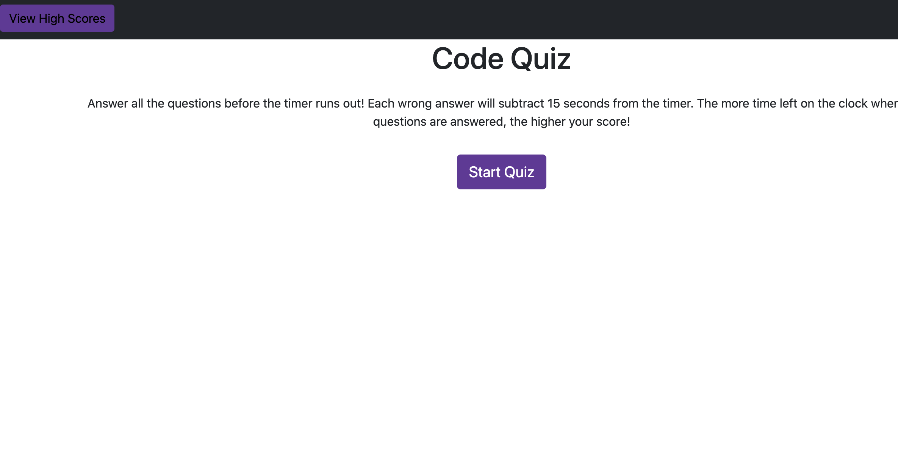
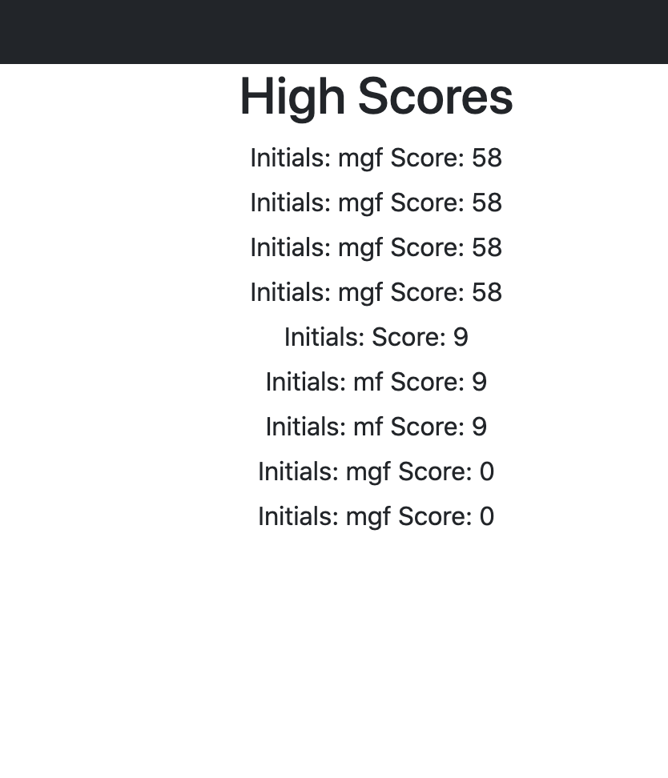
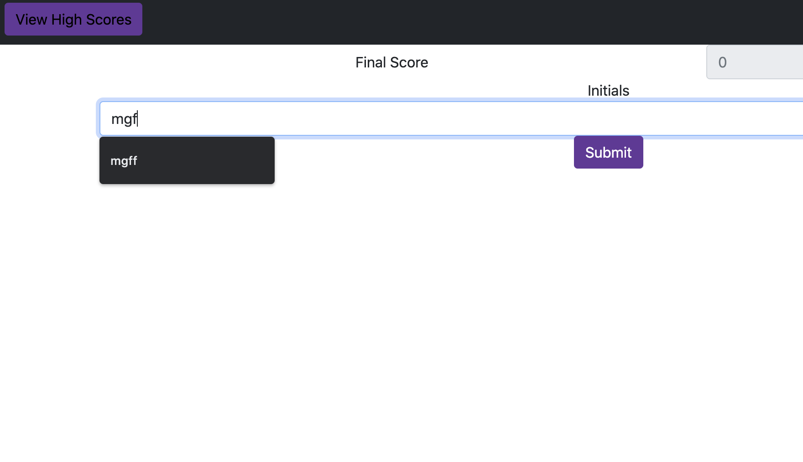
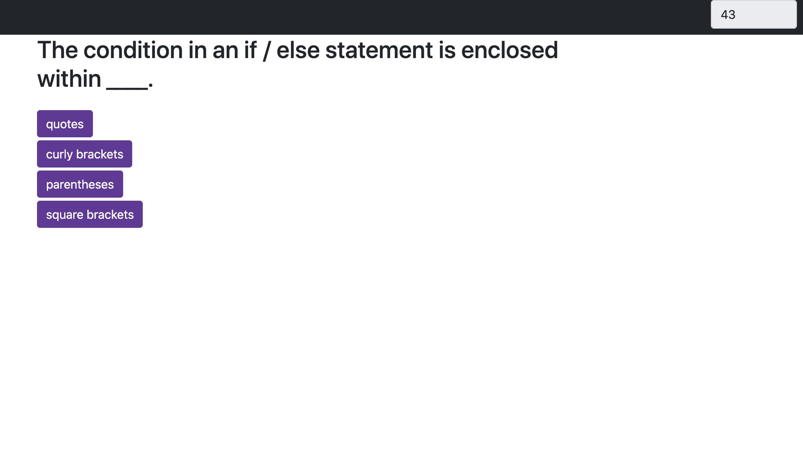
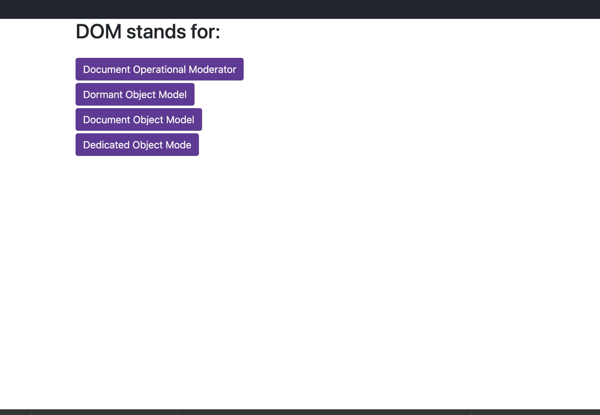

# code-quiz

## Description

This application is a multiple choice quiz with a timer. If you answer a question incorrectly, you are penalized with a deduction of time. At the end of the quiz, your time remaining is your score. You can then submit your initials and add your score to the high scores in local storage.

## Languages

This application uses HTML, CSS, Bootstrap, and Javascript

## Screenshots and Links

Here is the link to live application.

[Live-application](https://fausnightm.github.io/code-quiz/)

